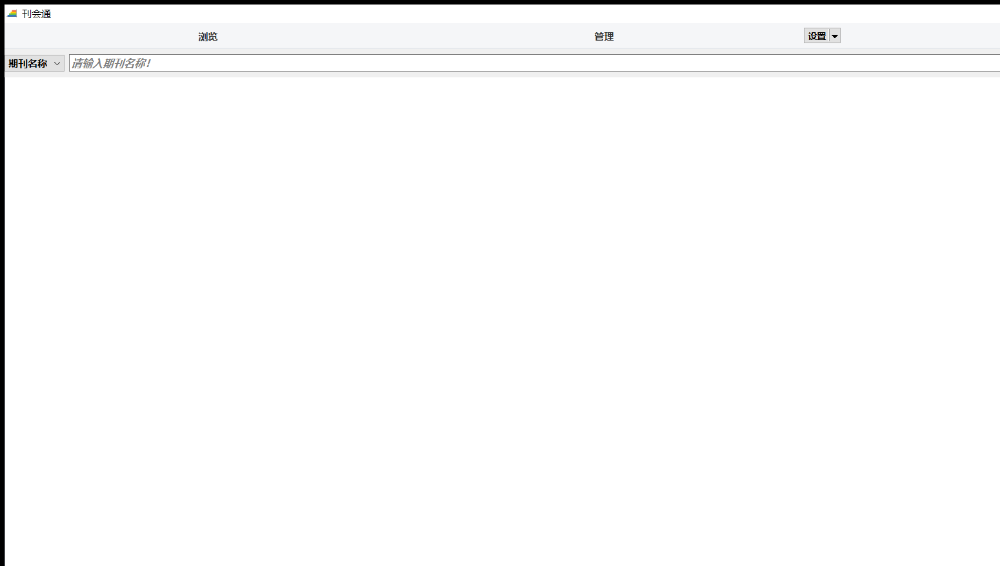
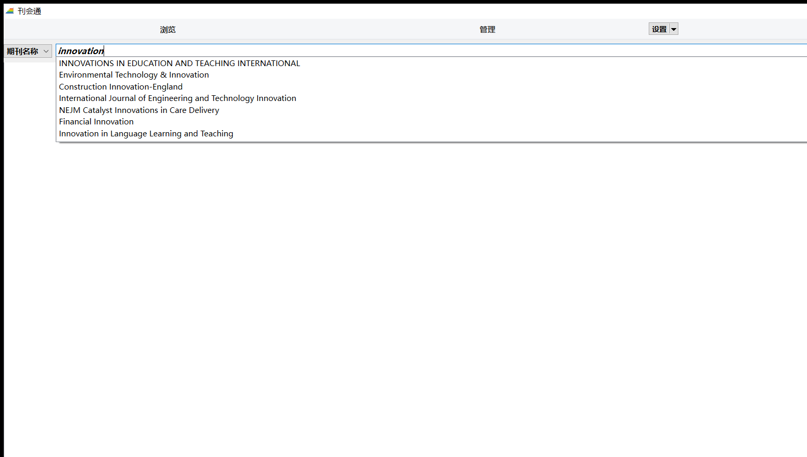

# 刊会通 KanHuiTong (kht)

> 本软件是在 [ShowJCR](https://github.com/hitfyd/ShowJCR)（作者 *hitfyd*）基础上的二次开发，开源协议遵循原项目的 **GNU GPL v3**，详见 [LICENSE](LICENSE)。

期刊分区与影响因子一站式查询工具，基于 Qt 6 Widgets + SQLite。

* **版本**：v1.0
* **仓库**：[https://github.com/wuruiqi/kht](https://github.com/wuruiqi/kht)
* **Release 下载**：[https://github.com/wuruiqi/kht/releases](https://github.com/wuruiqi/kht/releases)
* **作者**：Ruiqi_Wu · rqwu@haut.edu.cn

---

## 一、软件主界面



主界面（最大化）：

* 顶部扁平导航栏：`浏览` · `管理` · `设置` · `关于`，紧贴窗口左上、右边缘
* 搜索行：左侧"期刊名称 / ISSN / EISSN"字段切换 + 右侧关键词联想输入框
* 主结果区：按各数据表分类的期刊信息（年份、IF、大类分区、Top、小类分区等）

搜索框具有期刊名联想补全功能（`QCompleter`），效果如下：



---

## 二、数据来源

| 数据表             | 来源                                                                                  | 更新日期       |
| ------------------ | ------------------------------------------------------------------------------------- | -------------- |
| 中科院分区表升级版 | [advanced.fenqubiao.com](http://advanced.fenqubiao.com)                              | 2025-03-20     |
| 新锐期刊分区表     | [xr-scholar.com](https://www.xr-scholar.com)                                          | 2026-03-24     |
| JCR 影响因子与分区 | [Web of Science](https://webofscience.com)                                            | 2026-06-17     |
| 国际期刊预警等级   | [国际预警期刊名单（2020/2021/2023/2024/2025）](https://ewl.fenqubiao.com/#/README)    | 2025 年版      |
| CCF 推荐目录       | [CCF 推荐国际学术会议和期刊目录（2026）](https://www.ccf.org.cn/Academic_Evaluation/By_category/) | 2026 年版 |
| CCF 高质量科技期刊 | [计算领域高质量科技期刊分级目录（2025）](https://www.ccf.org.cn/ccftjgjxskwml/)       | 2025 年版      |

### 新锐期刊分区表 2026 年版特殊情况说明

1. `ADVANCED ENGINEERING MATERIALS`、`Soft Science` 具有两个大类分区，均为材料科学和工程技术；
2. `AUSTRALASIAN PLANT PATHOLOGY`、`HEART RHYTHM` 具有两本同名期刊，但是两者的 ISSN 号不一样。

---

## 三、SQLite3 数据库（`jcr.db`）

国际期刊信息的原始数据随附在源代码中（`中科院分区表及JCR原始数据文件/`）。

使用 [DB Browser for SQLite](https://sqlitebrowser.org/) 创建 `jcr.db`，csv 格式原始数据的导入顺序（jcr.db 中的表名）为：
`JCR2024` → `JCR2023` → `GJQKYJMD2025` → `GJQKYJMD2024` → `GJQKYJMD2023` → `GJQKYJMD2021` → `GJQKYJMD2020` → `CCF2026` → `CCFT2025` → `XR2026` → `XR2026Conferences` → `FQBJCR2025`

### 导入新的分区信息

导入新的分区信息，只需要在 `jcr.db` 增加相应的数据表，无需修改程序源代码。分区信息可以处理为 csv 格式，作为新的数据表使用 DB Browser for SQLite 导入到 `jcr.db`（包含在源代码和可执行版本中）。

新的分区信息表的字段格式可以是两种形式：

1. 表第一个数据字段为"Journal"，例如

   | Journal                   | IF(2021) |
   | ------------------------- | -------- |
   | PROCEEDINGS OF THE  IEEE  | 14.91    |
   | ······                    | ······   |

2. 表第一个数据字段为其他检索关键字（比如"期刊简称"、"中文刊名"等），第二个数据字段为"Journal"，例如

   | 刊物简称   | Journal                  | 领域           | CCF推荐类型 |
   | ---------- | ------------------------ | -------------- | ----------- |
   | Proc. IEEE | Proceedings of the IEEE | 交叉/综合/新兴 | A类         |
   | ······     | ······                   | ······         | ······      |

数据表的设计核心是必须包含 "Journal" 字段，该字段是程序默认的搜索字段；如果 "Journal" 不是数据表的第一个字段，则该字段之前的字段也将被增加为搜索字段，其字段数据也可以在程序中查询。

---

## 四、使用说明

### 4.1 主界面查询

* 在搜索框输入期刊名称、ISSN、EISSN 之一，软件会自动联想匹配的期刊名
* 按"回车"或点击"查询"按钮，下方结果区按各数据表分类展示命中期刊的完整信息
* 在显示的信息中：
  * "年份"字段设置为浅灰色以简易分隔 JCR、不同年份的中科院升级版
  * IF、预警信息、大类分区和"Top"等字段设置为红色以简易标记重要信息
* 期刊名称输入时具备联想功能，并且不区分大小写（如上方 image2 所示）

### 4.2 顶部"设置"菜单

软件提供 4 项快捷设置（位于顶部导航栏的"设置"下拉菜单）：

1. **开机自启动到托盘**：开机时自动以托盘模式启动
2. **关闭到托盘**：点击关闭按钮时最小化到系统托盘而非退出
3. **监听剪切板**：在后台监听剪切板，如果复制文字为期刊名称，将自动进行查询
4. **自动激活窗口**：与"监听剪切板"配合使用，当监听到期刊名称并自动查询完成后，将窗口显示到桌面最前

### 4.3 顶部"浏览"和"管理"模块（v1.0 新增）

在原 ShowJCR 基础上新增的两个数据表浏览/管理对话框：

* **浏览数据表**：查看各表全部数据，支持：
  * 按字段筛选（含"清除"按钮）
  * 字段显示/隐藏（独立对话框，全选/全不选）
  * 拖拽列宽
  * 导出全部 / 导出选中行（csv / xlsx）
  * 恢复默认列宽
* **管理数据表**：导入 (csv/xlsx)、导出、编辑备注、删除(需输入表名确认)、上移/下移排序(立即持久化)
* 表排序：年份降序 + 同年类别（中科院/新锐→JCR→CCF→预警）

---

## 五、二次开发说明（v1.0 vs 原 ShowJCR v2026-1.2）

本软件在原作者 *hitfyd* 的 [ShowJCR](https://github.com/hitfyd/ShowJCR) v2026-1.2 基础上进行了二次开发，主要变更如下：

### 5.1 重命名

* 软件名：**ShowJCR → 刊会通 KanHuiTong (kht)**
* 类名：`ShowJCR → Kht`；源文件 `showjcr.h/.cpp/.ui → kht.h/.cpp/.ui`
* EXE：`showjcr.exe → kht.exe`；CMake target：`showjcr → kht`
* 单实例共享内存 / 注册表键 / 日志文件名统一使用 `kht`

### 5.2 顶部导航栏重设计

* 原底部"开机自启动到托盘 / 关闭到托盘 / 监听剪切板 / 自动激活窗口"4 个 checkbox 整合到顶部"设置"下拉菜单，与对应的 checkbox 双向同步
* 顶部扁平样式导航栏：`浏览` · `管理` · `设置` · `关于`，紧贴窗口左上边缘
* 移除原"选择数据表"导航入口（保留 `show_selectTable()` 供托盘菜单调用）

### 5.3 新增功能（v1.0）

* **数据表浏览对话框**（`TableBrowserDialog`）：选表下拉、按字段筛选、字段显示/隐藏对话框（含全选/全不选）、拖拽列宽、导出全部/选中行
* **数据表管理对话框**（`TableManagerDialog`）：导入（csv/xlsx，含 Journal 字段校验 + 命名格式校验 + 重名检测）、导出、编辑备注、删除（需输入表名确认）、上移/下移排序（立即持久化）
* **元数据表 `__jcr_meta(table_name, remark, sort_order)**：备注和排序独立持久化；表显示名 = 元数据自定义 > 内置默认 > 原表名
* **xlsx 自实现 I/O**（用 Qt6Core 私有头 `QZipReader`/`QZipWriter` + `QXmlStreamWriter` 生成/解析 5 个 XML 部件）

### 5.4 兼容性

* 仍可作为 32/64 位 Windows 应用运行（已用 llvm-mingw 22.17 工具链验证）
* 数据库结构向后兼容：原 ShowJCR 的 `jcr.db` 可直接使用

---

## 六、Release 发布版

### 6.1 运行依赖

1. **`jcr.db`**：期刊信息数据库（已包含在源代码 `中科院分区表及JCR原始数据文件/` 中，也包含在可执行版本中）
2. **Qt6 运行时**：使用 `windeployqt` 获取所有依赖项并自动清理国际化 `translations` 文件夹
3. **`libc++.dll` + `libunwind.dll`**：llvm-mingw 运行时（windeployqt 不自动部署，需手动从工具链 `bin/` 复制）

### 6.2 可执行版本

提供 ZIP 压缩包：
**`kht-v1.0-win64.zip`**（解压到任意目录下执行 `kht.exe` 即可）

包含 15 项：
* `kht.exe` · `jcr.db`
* `Qt6Core.dll` · `Qt6Gui.dll` · `Qt6Sql.dll` · `Qt6Svg.dll` · `Qt6Widgets.dll`
* `libc++.dll` · `libunwind.dll`
* `platforms/qwindows.dll` · `sqldrivers/qsqlite.dll`
* `imageformats/qjpeg.dll` · `imageformats/qsvg.dll`
* `iconengines/qsvgicon.dll` · `styles/qmodernwindowsstyle.dll`

下载：[Releases · wuruiqi/kht](https://github.com/wuruiqi/kht/releases)

---

## 七、构建

### 7.1 工具链（全免管理员权限，D 盘即可）

* Qt 6.8.3（llvm-mingw 版）：`D:\Qt\6.8.3\llvm-mingw_64`
* LLVM-MinGW 22.17：`D:\Qt\Tools\llvm-mingw2217_64`
* CMake 3.30.5：`D:\build-tools\Tools\CMake_64`
* Ninja 1.12.1：`D:\build-tools\Tools\Ninja`

### 7.2 一键构建

```bash
python build.py
```

脚本依次执行：

1. CMake configure + generate（Ninja）
2. CMake build（Release 模式）
3. windeployqt 自动部署 Qt 依赖
4. 手动 `rm -f` 清理冗余 SQL 驱动（qsqlmimer/qsqlodbc/qsqlpsql）和图片格式（qgif/qico）

---

## 八、版权与许可

本软件是 [ShowJCR](https://github.com/hitfyd/ShowJCR) 的二次开发衍生作品，遵循原项目的开源协议：

```
GNU GENERAL PUBLIC LICENSE
   Version 3, 29 June 2007
```

详见 [LICENSE](LICENSE) 文件。

---

## 九、致谢

* 原作者 **hitfyd**：[https://github.com/hitfyd/ShowJCR](https://github.com/hitfyd/ShowJCR) —— 本软件的基础
* **Qt 团队**：[https://www.qt.io](https://www.qt.io) —— 跨平台 UI 框架
* **新锐学者**：[https://www.xr-scholar.com](https://www.xr-scholar.com) —— 新锐期刊分区表数据
* **中科院分区表**：[advanced.fenqubiao.com](http://advanced.fenqubiao.com) —— 中科院分区表升级版数据